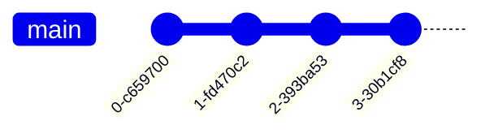

# README

* Some of Git's terminology and design choices are confusing at first but once
  you learn how Git works, it makes more sense.

* **Commits never change** - once you have made a commit, it is set forever
    * the _files in it_ never change
    * its _diff_ never changes
    * its _history_ never changes
    * the _message and author_ never change

* The reason commits never change is that their _ID_ is generated from their
  _contents_.
    * Every file, parent/s, message, author, and timestamp is used to generate
      a SHA-1 hash

* You can imagine that commits are a trail of diffs; combining all diffs
  together will result with the current state of the project. This is not how
  Git works but is a useful way of thinking about commits.

* You can also think of commits as a _pile of snapshots_ and this is how Git is
  implemented.

* _diffs_ are calculated from _snapshots_ - the _diff_ for a commit is the
  difference between it and its _parent_.

* Some things you can do with a commit:
    * Get the files in the commit (`git checkout`)
    * Calculate the diff from its parent (`git show`)
    * Merge it with another commit (`git merge`)
    * Examine its parents, grandparents, etc. (`git log`)

You can see how Git stores your files by using `git cat-file -p commit_hash`. 

```console
git cat-file -p $(git log | head -1 | cut -f2 -d' ')
```
```
tree d45baedabf242e3778d109c343aa3992180e10d9
parent f0f3e67f78fbe45547f097b000f68853168ca5f0
author Dave Tang <davetingpongtang@gmail.com> 1709510735 +0900
committer Dave Tang <davetingpongtang@gmail.com> 1709510735 +0900

Update remote URL
```

The hash in `tree d45baedabf242e3778d109c343aa3992180e10d9` is the directory
ID. Use the directory ID to read the directory.

```console
git cat-file -p d45baedabf242e3778d109c343aa3992180e10d9
```
```
040000 tree d5306cbca42870de6b6a360ffcd3db5bf88a244f	.github
100644 blob 783cd5baaf2fd95f3b3c8fe827d52453d36e410d	.gitignore
100644 blob 0e259d42c996742e9e3cba14c677129b2c1b6311	LICENSE
100644 blob 86b2926b3121634b7157f1158551cfff91dd6e0b	README.md
040000 tree c472474bf28be1165285800c4638b2401a2d132d	gitlab
040000 tree 8374f62914849d013893fe59eb719b8a4913087a	img
100755 blob 36b78478b72180abbd731fd6e423a90323f0f0cc	now.sh
100755 blob f8653d2271f69710d0e9232b052de9a2756f827f	rename_master_to_main.sh
040000 tree 719a1ad9dd7ebc466777336b54acab45f89206cf	rmarkdown
```

The hash in `100755 blob 36b78478b72180abbd731fd6e423a90323f0f0cc	now.sh` is
the file ID. This SHA-1 hash is generated by the contents of `now.sh`. (You
can't simply generate this hash on the file by using `sha1sum` because the
[hash is generated using other information
too](https://stackoverflow.com/questions/5290444/why-does-git-hash-object-return-a-different-hash-than-openssl-sha1).)

We can use the hash to read the file.

```console
git cat-file -p 36b78478b72180abbd731fd6e423a90323f0f0cc
```
```
#!/usr/bin/env bash

set -euo pipefail

now(){
   date '+%Y/%m/%d %H:%M:%S'
}

# seconds to sleep
s=2

>&2 printf "[ %s %s ] Start\n" $(now)
>&2 echo Sleeping for ${s} seconds
sleep ${s}
>&2 printf "[ %s %s ] End\n" $(now)

exit 0
```

* Storing files by their hash makes Git efficient: if you change one file, Git
  only needs to save one new blob to store the snapshot.

* While commits are usually saved forever but Git's garbage collection
  periodically deletes _unreachable commits_.

* Some ways commits get "lost" include:
    * `git commit --amend`
    * `git rebase`
    * deleting a branch that has not been merged

* Sometimes a commit isn't in the history of any branch or tag but you can find
  them with `git reflog`

* Sometimes a commit isn't referenced anywhere and you need to search all
  commits to find it.

* A commit can get lost using `git commit --amend`, `git rebase`, and `git
  branch -D feature` (deleting an unmerged branch).

* In Git, moving a file is the same as deleting the old one and adding the new
  one.

```console
git mv old.sh new.sh

git rm old.sh
git add new.sh
```

* diff is an algorithm that:

1. takes two versions of code,
2. compares them, and
3. tries to make a human readable summary (but it doesn't always work well)

* Git has many diff algorithms and the histogram method does a better job if
you rearrange your code. You can use change it to histogram using `git config`.

```console
git config --global diff.algorithm histogram
```

* Git has a two-stage commit process:
    * Stage untracked files and unstaged changes using `git add`, `git rm`,
      `git mv`, etc.
    * Commit using `git commit`

* Git uses three terms interchangeably for the staging area (but they are all
  the same thing):
    * Staged (`--staged`)
    * Cache (`--cached`)
    * Index (`--keep-index`)

* You can use `git add -p` to only commit certain parts of a file.

* `git diff` only shows unstaged changes; if you want to see all changes that
have not been committed, use `git diff HEAD`.

* `git commit -a` does not automatically add new files.

* Theoretically you can use Git without using branches and keep track of commit
  IDs manually.

* Every branch has three things:
    * a name (like `main`)
    * a latest commit
    * a reflog showing how much that branch has evolved over time

* Branches also have a corresponding remote branch which they track.

```console
git remote show origin
```
```
* remote origin
  Fetch URL: git@github.com:davetang/getting_started_with_git.git
  Push  URL: git@github.com:davetang/getting_started_with_git.git
  HEAD branch: main
  Remote branches:
    main            tracked
    test_gh_actions tracked
  Local branch configured for 'git pull':
    main merges with remote main
  Local ref configured for 'git push':
    main pushes to main (up to date)
```

* Branches are core to how Git stores your work; if your commits are lost,
  i.e., not on a branch, they will become difficult to find and Git's garbage
  collection will eventually delete them.

* The _only difference_ between the `main` branch and any other branch is how
  you treat them; for example, it is common to never commit to `main` directly
  but to commit to other branches that are later merged.

* All changes to a branch are recorded in its `reflog` (reference log).

```console
git reflog main
```

* Some gotchas:
    * when you push/pull a branch, the name **does not** have to match
    * you can **remove** commits from a branch with `git reset`
    * Often Git won't protect you from messing up your branch!

* You can think of a Git branch in three different ways

1. Just the commits that branch off, like how `develop` branches off `main`.
   Git does not know that `develop` is branched off of `main`; you will need to
   tell Git when you merge or rebase (`git rebase main`).


2. Every previous commit; this is what `git log main` will show you.



3. Just the commit at the end; this is how branches are stored internally. **A
   branch is fundamentally a _name_ for a _commit ID_**.

```console
cat .git/refs/heads/main
```
```
c9c959ba5d1a30bb6c87fab29854524867f34259
```

`c9c959ba5d1a30bb6c87fab29854524867f34259` is the ID of the latest commit on `main`.

```console
git log | head -1
```
```
commit c9c959ba5d1a30bb6c87fab29854524867f34259
```

* Many Git accidents are caused by running a command while on the wrong branch.

* Try to keep track of two things:

1. Check whether you're on a branch or a detached HEAD state
2. Check whether you're in the middle of a multistep operation (`rebase`,
   `merge`, `bisect`, etc.)

* Use a prompt that keeps track of the current branch like
  [ohmyzsh](https://github.com/ohmyzsh/ohmyzsh/).

* `.git/HEAD` is used by Git to store either:

1. A branch name: the current branch
2. A commit ID, which means that you do not have a current branch; this is
   called a "detached HEAD state".

```console
cat .git/HEAD
```
```
ref: refs/heads/main
```

By itself, `.git/HEAD` being a commit ID is fine; it's a good way to look at
old versions of code and Git does it internally during a rebase. The only
problem is that new commits may get lost since it won't be on any branch.

You can end up in a detached HEAD state if you checkout:

1. A tag - `git checkout v0.1.0`
2. A remote-tracking branch - `git checkout origin/main`
3. A commit ID - `git checkout hash`

If you accidentally create commits in the detached HEAD state, you can avoid
losing them by creating a new branch:

```console
`git switch -c oops`
```

You can always use HEAD to get the latest commit on the current branch; if you
run `git show HEAD`, it will always show you the current commit, whether or not
you're in the detached HEAD state.


