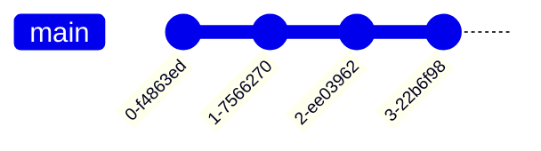

# README

* Some of Git's terminology and design choices are confusing at first but once
  you learn how Git works, it makes more sense.

* **Commits never change** - once you have made a commit, it is set forever
    * the _files in it_ never change
    * its _diff_ never changes
    * its _history_ never changes
    * the _message and author_ never change

* The reason commits never change is that their _ID_ is generated from their
  _contents_.
    * Every file, parent/s, message, author, and timestamp is used to generate
      a SHA-1 hash

* You can imagine that commits are a trail of diffs; combining all diffs
  together will result with the current state of the project. This is not how
  Git works but is a useful way of thinking about commits.

* You can also think of commits as a _pile of snapshots_ and this is how Git is
  implemented.

* _diffs_ are calculated from _snapshots_ - the _diff_ for a commit is the
  difference between it and its _parent_.

* Some things you can do with a commit:
    * Get the files in the commit (`git checkout`)
    * Calculate the diff from its parent (`git show`)
    * Merge it with another commit (`git merge`)
    * Examine its parents, grandparents, etc. (`git log`)

You can see how Git stores your files by using `git cat-file -p commit_hash`.
The `-p` parameter is for `pretty-print <object> content`.

```console
git cat-file -p $(git log | head -1 | cut -f2 -d' ')
```
```
tree d45baedabf242e3778d109c343aa3992180e10d9
parent f0f3e67f78fbe45547f097b000f68853168ca5f0
author Dave Tang <davetingpongtang@gmail.com> 1709510735 +0900
committer Dave Tang <davetingpongtang@gmail.com> 1709510735 +0900

Update remote URL
```

The hash in `tree d45baedabf242e3778d109c343aa3992180e10d9` is the directory
ID. Use the directory ID to read the directory.

```console
git cat-file -p d45baedabf242e3778d109c343aa3992180e10d9
```
```
040000 tree d5306cbca42870de6b6a360ffcd3db5bf88a244f	.github
100644 blob 783cd5baaf2fd95f3b3c8fe827d52453d36e410d	.gitignore
100644 blob 0e259d42c996742e9e3cba14c677129b2c1b6311	LICENSE
100644 blob 86b2926b3121634b7157f1158551cfff91dd6e0b	README.md
040000 tree c472474bf28be1165285800c4638b2401a2d132d	gitlab
040000 tree 8374f62914849d013893fe59eb719b8a4913087a	img
100755 blob 36b78478b72180abbd731fd6e423a90323f0f0cc	now.sh
100755 blob f8653d2271f69710d0e9232b052de9a2756f827f	rename_master_to_main.sh
040000 tree 719a1ad9dd7ebc466777336b54acab45f89206cf	rmarkdown
```

The hash in `100755 blob 36b78478b72180abbd731fd6e423a90323f0f0cc	now.sh` is
the file ID. This SHA-1 hash is generated by the contents of `now.sh`. (You
can't simply generate this hash on the file by using `sha1sum` because the
[hash is generated using other information
too](https://stackoverflow.com/questions/5290444/why-does-git-hash-object-return-a-different-hash-than-openssl-sha1).)

We can use the hash to read the file.

```console
git cat-file -p 36b78478b72180abbd731fd6e423a90323f0f0cc
```
```
#!/usr/bin/env bash

set -euo pipefail

now(){
   date '+%Y/%m/%d %H:%M:%S'
}

# seconds to sleep
s=2

>&2 printf "[ %s %s ] Start\n" $(now)
>&2 echo Sleeping for ${s} seconds
sleep ${s}
>&2 printf "[ %s %s ] End\n" $(now)

exit 0
```

* Storing files by their hash makes Git efficient: if you change one file, Git
  only needs to save one new blob to store the snapshot.

* While commits are usually saved forever, Git's garbage collection
  periodically deletes _unreachable commits_.

* Some ways commits get "lost" include:
    * `git commit --amend`
    * `git rebase`
    * deleting a branch that has not been merged `git branch -D blah`

* Sometimes a commit isn't in the history of any branch or tag but you can find
  them with `git reflog`

* Sometimes a commit isn't referenced anywhere and you need to search all
  commits to find it.

* In Git, moving a file is the same as deleting the old one and adding the new
  one.

```console
git mv old.sh new.sh

git rm old.sh
git add new.sh
```

* diff is an algorithm that:

1. takes two versions of code,
2. compares them, and
3. tries to make a human readable summary (but it doesn't always work well)

The Git merge conflicts URL was added in commit 3a2d3e.

```console
git diff e54dba 3a2d3e
```
```
diff --git a/README.md b/README.md
index 86b2926..2bd3ce3 100644
--- a/README.md
+++ b/README.md
@@ -832,4 +832,4 @@ Another way around this is to change your container `uid` to match the `actions-
 * [Bioinformatics Data Skills](http://shop.oreilly.com/product/0636920030157.do) chapter 5 "Git for Scientists"
 * My [Git Wiki page](https://davetang.org/wiki2/index.php?title=Git)
 * My old [blog post](https://davetang.org/muse/2013/09/04/getting-started-with-git/)
-
+* [Git merge conflicts](https://www.atlassian.com/git/tutorials/using-branches/merge-conflicts)
```

* Git has many diff algorithms and the histogram method does a better job if
you rearrange your code. You can use change it to histogram using `git config`.

```console
git config --global diff.algorithm histogram
```

* Git has a two-stage commit process:
    * Stage untracked files and unstaged changes using `git add`, `git rm`,
      `git mv`, etc.
    * Commit using `git commit`

* Git uses three terms interchangeably for the staging area (but they are all
  the same thing):
    * Staged (`--staged`)
    * Cache (`--cached`)
    * Index (`--keep-index`)

* You can use `git add -p` to only commit certain parts of a file.

* `git diff` only shows unstaged changes; if you want to see all changes that
have not been committed, use `git diff HEAD`.

* `git commit -a` does not automatically add new files.

* Theoretically you can use Git without using branches and keep track of commit
  IDs manually.

* Every branch has three things:
    * a name (like `main`)
    * a latest commit
    * a reflog showing how much that branch has evolved over time

* Branches also have a corresponding remote branch which they track.

```console
git remote show origin
```
```
* remote origin
  Fetch URL: git@github.com:davetang/getting_started_with_git.git
  Push  URL: git@github.com:davetang/getting_started_with_git.git
  HEAD branch: main
  Remote branches:
    main            tracked
    test_gh_actions tracked
  Local branch configured for 'git pull':
    main merges with remote main
  Local ref configured for 'git push':
    main pushes to main (up to date)
```

* Branches are core to how Git stores your work; if your commits are lost,
  i.e., not on a branch, they will become difficult to find and Git's garbage
  collection will eventually delete them.

* The _only difference_ between the `main` branch and any other branch is how
  you treat them; for example, it is common to never commit to `main` directly
  but to commit to other branches that are later merged.

* All changes to a branch are recorded in its `reflog` (reference log).

```console
git reflog main
```

* Some gotchas:
    * when you push/pull a branch, the name **does not** have to match
    * you can **remove** commits from a branch with `git reset`
    * Often Git won't protect you from messing up your branch!

* You can think of a Git branch in three different ways

1. Just the commits that branch off, like how `develop` branches off `main`.
   Git does not know that `develop` is branched off of `main`; you will need to
   tell Git when you merge or rebase (`git rebase main`).


2. Every previous commit; this is what `git log main` will show you.



3. Just the commit at the end; this is how branches are stored internally. **A
   branch is fundamentally a _name_ for a _commit ID_**.

```console
cat .git/refs/heads/main
```
```
c9c959ba5d1a30bb6c87fab29854524867f34259
```

`c9c959ba5d1a30bb6c87fab29854524867f34259` is the ID of the latest commit on `main`.

```console
git log | head -1
```
```
commit c9c959ba5d1a30bb6c87fab29854524867f34259
```

* Many Git accidents are caused by running a command while on the wrong branch.

* Try to keep track of two things:

1. Check whether you're on a branch or a detached HEAD state
2. Check whether you're in the middle of a multistep operation (`rebase`,
   `merge`, `bisect`, etc.)

* Use a prompt that keeps track of the current branch like
  [ohmyzsh](https://github.com/ohmyzsh/ohmyzsh/).

* `.git/HEAD` is used by Git to store either:

1. A branch name: the current branch
2. A commit ID, which means that you do not have a current branch; this is
   called a "detached HEAD state".

```console
cat .git/HEAD
```
```
ref: refs/heads/main
```

By itself, `.git/HEAD` being a commit ID is fine; it's a good way to look at
old versions of code and Git does it internally during a rebase. The only
problem is that new commits may get lost since it won't be on any branch.

You can end up in a detached HEAD state if you checkout:

1. A tag - `git checkout v0.1.0`
2. A remote-tracking branch - `git checkout origin/main`
3. A commit ID - `git checkout hash`

If we use checkout on a commit ID.

```console
git checkout 789ec29a661768146367ac3a545b1924fabb5992
```
```
Note: switching to '789ec29a661768146367ac3a545b1924fabb5992'.

You are in 'detached HEAD' state. You can look around, make experimental
changes and commit them, and you can discard any commits you make in this
state without impacting any branches by switching back to a branch.

If you want to create a new branch to retain commits you create, you may
do so (now or later) by using -c with the switch command. Example:

  git switch -c <new-branch-name>

Or undo this operation with:

  git switch -

Turn off this advice by setting config variable advice.detachedHead to false

HEAD is now at 789ec29 Hello instead of hi
```

Check out `.git/HEAD`.

```console
cat .git/HEAD
```
```
789ec29a661768146367ac3a545b1924fabb5992
```

If you accidentally create commits in the detached HEAD state, you can avoid
losing them by creating a new branch (as Git advised above):

```console
git switch -c oops
```

Use `git switch -` to switch back to `main`.

You can always use HEAD to get the latest commit on the current branch; if you
run `git show HEAD`, it will always show you the current commit, whether or not
you're in the detached HEAD state.

Git often uses the term "reference" in error messages

```console
git switch blah
```
```
fatal: invalid reference: blah
```

Reference often just means branch, such as the example above where the `blah`
branch does not exist.

References are files: either `.git/HEAD` or files in `.git/refs`. There are
five main types of references.

1. HEAD: - `.git/HEAD`
2. branches - `.git/refs/heads/BRANCH`
3. tags - `.git/refs/tags/TAG`
4. remote-tracking branches - `.git/refs/remotes/REMOTE/BRANCH`
5. stash - `.git/refs/stash`

All of the above (except 1.) are files that contain a commit ID but the way
that commit ID is used depends on the _type_ of reference.

There are also references in `.git/FETCH_HEAD` and `.git/refs/notes/`.

Git's garbage collection uses references to decide which commits to delete; the
algorithm is:

1. Find all references and every commit in every reference's reflog
2. Find every commit in the history of any of those commits
3. Delete every commit that was not found

Here's an overview of stuff inside the `.git` folder:

* `HEAD` is a tiny file (`.git/HEAD`) that just contains the name of your
  current branch; it can also contain a commit ID, that's called "detached HEAD
  state".

* A branch is stored as a tiny file (`.git/refs/heads/main`) that just contains
  one commit ID; tags are in `refs/tags` and the stash is in `refs/stash`.

* A commit is a small file (`.git/objects/10/hash`) containing its parent/s,
  message, tree, and author. These files are compressed and in binary but can
  be viewed using `git cat-file -p hash`. (Merges are commits with two or more
  parents.)

* Trees are small files with directory listings (like a regular directory). The
  files in it are called blobs and are the files that contain your code/text.
  Storing a new blob with every change can take up a lot of space, so `git gc`
  periodically packs them for efficient storage in `.git/objects/pack`.

* The reflog stores the history of every branch, tag, and HEAD. Each line of
  the reflog has:

1. Before/after commit IDs
2. User
3. Timestamp
4. Log message

* Remote-tracking branches (`.git/refs/remotes/origin/main`) store the most
  recently seen commit ID for a remote branch. When `git status` shows that
  you're up to date with `origin/main`, it is just looking at this file.

* The config file (`.git/config`) is where you configure remotes. Git has
  global and local settings; the local settings are here and the global ones in
  `${HOME}/.gitconfig`.

* Hooks are optional scripts that you can set up to run (before a commit for
  example) anything you want. Check out `.git/hooks/pre-commit.sample` for an
  example.

* The staging area (`.git/index`) stores files that you are preparing to
  commit.

Merging is an important concept in Git but the terminology around merging can
be confusing.

* `git merge` isn't the only way to combine branches; you can also use `git
rebase`.

* A merge conflict can happen if you do any of the following:
    * `git merge`
    * `git rebase`
    * `git cherry-pick`
    * `git revert`
    * `git stash pop`

* Merge commits are only created by using `git merge`.

There are three situations when combining branches:

1. No divergence (a.k.a. fast-forward) is easy and `git merge` will move the
   "behind" branch forward.

2. Diverged branches (when editing different code) with no conflicts is a bit
   harder and you have to decide whether to merge or rebase.

3. Diverged branches with merge conflicts (when editing the same code) is the
   hardest to resolve and you have to decide whether to merge or rebase and fix
   a merge conflict.

`git merge` checks for these three situations in order.

* `git pull` needs to combine branches too and will only fast-forward by
  default. If that's not possible, Git will ask you to specify if you want to
  rebase or merge. `git pull --rebase` will run `git rebase` and `git pull
  --no-rebase` will run `git merge`.

There are three options for combining branches:

1. rebase
2. merge
3. squash

All three methods result in the same exact code but some differences include
the history and the diff Git shows for the final commit.

Some pros and cons for each option.

1. rebase
    * Pros: the history is simple
    * Cons: harder to learn, to undo, and easier to mess up
2. merge
    * Pros: if you make a mistake, the original commits are still in the
      branch's history
    * Cons: the history gets complicated
3. squash
    * Pros: simple to use
    * Cons: hides details

Merge conflicts happen because both branches edited the same lines of code.
Some ways to resolve merge conflicts:

1. Edit the "weird text file" manually (often the easiest way).
2. Use a dedicated merge conflict tool (Git can be configured such that `git
   mergetool` opens conflicts in your tool of choice, like `meld`).
3. Abort the merge and re-write the code you were merging from scratch (this
   might be easier if there was a big refactor).
4. If the conflict is in an autogenerated file, delete and regenerate it.

Git merge conflicts can be confusing because they are not displayed in the
"weird text file" in a consistent manner:

* The code from the branch you started on is:
    * at the top if you merged
    * at the bottom if you rebased
* Git often won't provide the branch name that the code comes from

To finish, take a look at the changes with `git diff main`, check for
unresolved conflicts with `git diff --check`, and rerun tests. Then run one of
the following:

* `git commit` for `git merge`
* `git rebase --continue` for `git rebase`
* `git cherry-pick --continue` for `git cherry-pick`
* `git revert --continue` for `git revert`

Merging two diverged branches creates a commit `git merge branch` but it is
important to be aware of some pitfalls.

Merging is not symmetric. For example:

Merging into main

```
git checkout main
git merge fix
```

and merging into fix

```
git checkout fix
git merge main
```

result in the same code but the merge commit's parents have a different order.
This comes up when you use `HEAD^`: it refers to the first parent, and usually
we want that to be the commit from the main branch.

`git show` doesn't always tell you what the merge commit did. It will sometimes
just show the merge commit as empty.

To see what a merge did, use

    git show --remerge-diff COMMIT_ID

This will re-merge the parents and show you the difference between the original
merge and what's actually in the merge commit.

Any repository you are pushing to or pulling from is called a "remote". Remotes
can be:

* Hosted by GitHub/GitLab/etc.
* On your own server
* Just a folder on your computer

The default name for a remote is `origin` but you can change it to anything. Run

    git push origin main

where `origin` is the remote name and `main` is the remote branch. A nice tip
is to set `push.autoSetupRemote true` to automatically set up tracking the
first time a new branch is pushed.

Remotes are configured in `.git/config` and every remote has a name and URL. It
is also used to set up tracking between the local `main` and the remote `main`
on `origin`. This is to let Git know what to push to when you run `git push` or
`git pull`.

One use case is to use two remotes when contributing to open-source projects.
Pull from the main project repo, push to a personal fork, and finally make a
pull request.

Git has three main protocols for remotes; the protocol is embedded in the URL
in `.git/config`.

1. HTTPS (use only if you only want to pull)
2. SSH (use if you need to push)
3. Local (e.g., file:///home/dtang/myrepo)

Diverged branches are a typical problem when pushing/pulling with remote
branches. This happens when both sides have commits that the other does not.

Use `git fetch` (get the latest remote state first) and `git status` to see if
the branches have diverged.

There are four possibilities with a remote branch:

1. Up-to-date
2. Need to pull
3. Need to push
4. Diverged

When branches are diverged, you need to decide how to solve it. One solution is
to run `git pull --rebase`.

There are three ways to reconcile two diverged brances

1. Combine the changes from both with `rebase` or `merge`
    * `git pull --rebase` and `git push`
    * `git pull --no-rebase` and `git push`
2. Throw out your local changes
    * `git switch -c newbranch`
    * `git switch main`
    * `git reset --hard origin/main`
3. Throw out the remote changes (but be careful with this approach!)
    * `git push --force` (this is always dangerous; `--force-with-lease` is a
      little safer)

Reasons to throw away changes:

1. Accidentally committed to `main` instead of a new branch
2. Throwing away remote changes is we want to amend a commit after pushing it
   and we are the **only person** working on that branch

However, the "up to date" status from `git status` may be misleading. This does
not mean that you are up to date with the remote main branch. Some version
control software only work with Internet connectivity but Git works offline.
Nothing in Git will use the Internet except `git pull`, `git push`, and `git
fetch`.

Every remote branch has a local cache named like `origin/mybranch`; but this is
not called a cache by Git and is known as a "remote tracking branch". This
cache is only updated on `git pull`, `git push`, and `git fetch`.

Commits in the history of a branch/tag never change and you can always use the
commit ID to get you work back. However, some unreachable commits are hard to
find and they will eventually get deleted by Git's garbage collection (usually
not for a few months though).

Branches and HEAD change all the time but there is a history of all the changes
in the reflog; the reflog is not easy to use but at least it is there.

The staging area changes all the time and there is no history.

`git stash` is usually used to throw away work and `git stash drop` deletes
entries forever. You can technically get them back by using `git fsck` to
search every single commit.

Git has no undo; there is no uncommit, unmerge, and unrebase. Instead, Git has
a single **dangerous** command for undoing: `git reset`.

Most Git commands move the current branch forwards (though rebase is a sideways
move).

`git reset` can move the current branch _anywhere_: backwards, forwards, and
sideways! This makes it possible to undo but you can also mess up your branch.

`git reset HEAD^` finds the commit ID corresponding to `HEAD^` and orces your
current branch to point to that commit ID.

`git reset COMMIT` keeps all the files in your working directory _exactly the
same_ but `git reset --hard COMMIT` throws away all your uncommited changes,
which is useful but dangerous.

Using `git reset` can result in lost commits, especially if you move a branch
backwards. If you use `--hard` you can **permanently lose** your uncommited
changes.

When looking for commits, it can be:

1. Easy if it's on a branch
2. Annoying if it's in the reflog
3. Nightmare if you need to search every single commit using `git fsck`

A reflog is a log of hashes and it contains every commit ID that the
branch/tag/HEAD has ever pointed to.

The two main reflog to use are:

1. `git reflog` which contains:
    * every single commit you have ever had checked out
    * has everything but is noisy
    * it's the reflog for HEAD
2. `git reflog BRANCH` which contains just the history for that branch and
   might be less noisy

* When you delete a branch, Git deletes its reflog
* If you delete a stash entry, you can't use the reflog to get it back
* reflog entries don't correspond exactly to Git commands you ran

To use the reflog:

1. Run `git reflog`
2. Manually look for the commit ID
3. Look into the commit
    * `git show COMMIT`
    * `git log COMMIT`
4. Repeat until you find the commit you were looking for
5. Use something like
    * `git reset COMMIT` or
    * `git branch NAME COMMIT`
   to get the commit on the branch.

`git fsck` searches every commit and is the last resort if all else fails when
trying to find a commit.
